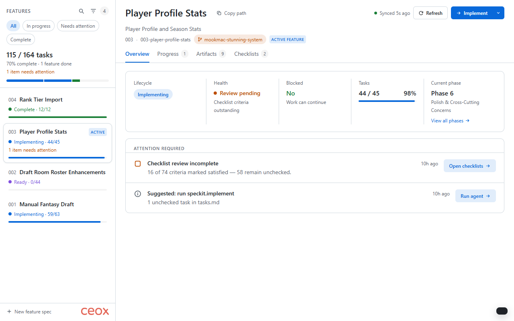

# Spec-kit Canvas

A GitHub Copilot canvas for browsing a repository's [spec-kit](https://github.com/github/spec-kit) features, seeing each spec's pipeline status at a glance, and dispatching the next speckit agent straight into your chat session.



## What it does

- **Feature board** — every folder under `specs/` as a card with live status, task progress, and attention counts.
- **Pipeline status** — derives where each feature sits in the `specify → clarify → plan → tasks → implement` cycle, plus a computed "next agent" with the reason why.
- **Attention required** — surfaces real, disk-grounded signals: open `[NEEDS CLARIFICATION]` markers, stale plan/tasks artifacts, unchecked checklist criteria, and empty task lists.
- **One-click dispatch** — run the next speckit agent (`speckit.specify`, `speckit.plan`, `speckit.implement`, …) from the canvas; the command is sent to your current Copilot session.
- **Live updates** — watches `specs/` and `.specify/` and pushes state over Server-Sent Events, so the board reflects agent edits in real time.
- **Artifact viewer** — read `spec.md`, `plan.md`, `tasks.md`, research, checklists, and contracts inline with rendered Markdown.

Everything shown is derived from files on disk — no invented metrics.

## Files

- `plugin.json` — plugin manifest used by the extension marketplace and website.
- `assets/preview.png` — gallery preview image.
- `extensions/speckit-canvas/extension.mjs` — loopback canvas server, API routes, SSE, file watching, and the session bridge.
- `extensions/speckit-canvas/speckit.mjs` — the scanner: parses specs/tasks/checklists, derives status, health, phases, and attention items.
- `extensions/speckit-canvas/public/` — the canvas UI (`index.html`, `styles.css`, `app.js`).
- `extensions/speckit-canvas/copilot-extension.json` — Copilot extension name/version metadata.
- `extensions/speckit-canvas/package.json` — extension metadata for cataloging and packaging.

## Install

Ask Copilot to install the committed extension URL:

```text
Install this extension: https://github.com/CeoxServicesLtd/speckit-canvas
```

Or copy this folder into one of these locations:

- `~/.copilot/extensions/speckit-canvas/` — user scope
- `.github/extensions/speckit-canvas/` — project scope

Reload extensions in the app, then open the `speckit-canvas` canvas.

## Usage

Open the canvas in a repository that uses spec-kit (a `specs/` directory and `.specify/` config). The board scans automatically. Select a feature to inspect it, then use the primary action button (or the Actions menu) to dispatch the next agent. Keyboard: `j`/`k` or arrow keys move between features, `/` focuses search, `Ctrl+Enter` runs the agent, `Esc` closes dialogs.

## Agent actions

- `refresh` — re-scan the specs folder and push the latest state to the canvas.
- `get_status { feature? }` — return the pipeline status for one feature or all features.
- `focus_feature { feature }` — select a feature in the canvas and set it as the active spec-kit feature.

## Requirements

- GitHub Copilot CLI with extension/canvas support.
- A repository using [spec-kit](https://github.com/github/spec-kit) (`specs/` + `.specify/`).
