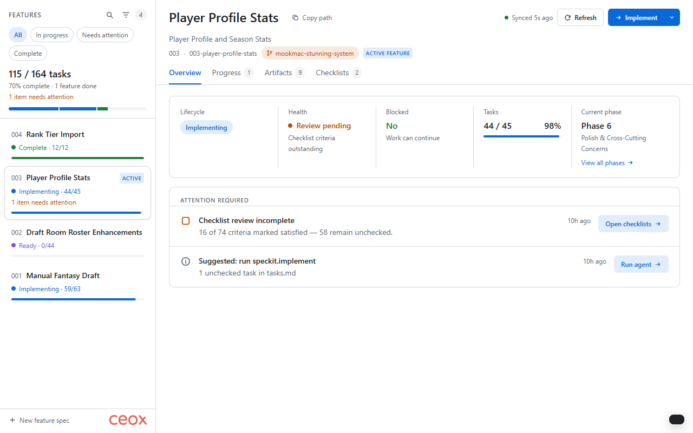

# Spec-kit Canvas

A GitHub Copilot canvas for browsing a repository's [spec-kit](https://github.com/github/spec-kit) features, seeing each spec's pipeline status at a glance, and dispatching the next speckit agent straight into your chat session.



## What it does

- **Feature board** — every folder under `specs/` as a card with live status, task progress, and attention counts.
- **Pipeline status** — derives where each feature sits in the `specify → clarify → plan → tasks → implement` cycle, plus a computed "next agent" with the reason why.
- **Attention required** — surfaces real, disk-grounded signals: open `[NEEDS CLARIFICATION]` markers, stale plan/tasks artifacts, unchecked checklist criteria, and empty task lists.
- **One-click dispatch** — run the next speckit agent (`speckit.specify`, `speckit.plan`, `speckit.implement`, …) from the canvas; the command is sent to your current Copilot session.
- **Live updates** — watches `specs/` and `.specify/` and pushes state over Server-Sent Events, so the board reflects agent edits in real time.
- **Artifact viewer** — read `spec.md`, `plan.md`, `tasks.md`, research, checklists, and contracts inline with rendered Markdown.
- **Repository constitution** — read `.specify/memory/constitution.md` from the sidebar's Repository section, separately from feature artifacts, even when there are no specs. The read-only view updates live and preserves your selected feature and tab.

Everything shown is derived from files on disk — no invented metrics.

## Files

- `plugin.json` — plugin manifest used by the extension marketplace and website.
- `.github/plugin/marketplace.json` — marketplace catalog for discovering and installing the plugin in Copilot.
- `assets/preview.png` — gallery preview image.
- `extensions/speckit-canvas/extension.mjs` — loopback canvas server, API routes, SSE, file watching, and the session bridge.
- `extensions/speckit-canvas/speckit.mjs` — the scanner: parses specs/tasks/checklists, derives status, health, phases, and attention items.
- `extensions/speckit-canvas/public/` — the canvas UI (`index.html`, `styles.css`, `app.js`).
- `extensions/speckit-canvas/copilot-extension.json` — Copilot extension name/version metadata.
- `extensions/speckit-canvas/package.json` — extension metadata for cataloging and packaging.

## Install

### GitHub Copilot app (recommended)

Register the marketplace and install the plugin using the Copilot CLI with the same user/configuration as the app:

```powershell
copilot plugin marketplace add CeoxServicesLtd/speckit-canvas
copilot plugin install speckit-canvas@ceox-speckit
```

The registered marketplace can then be browsed in the app's **Customize → Plugins** view. This installs the canvas as a managed plugin rather than copying a standalone extension.

Restart the app/session or reload extensions, then open **Spec-kit board** (canvas ID `speckit-canvas`).

If you previously installed a standalone copy under `~/.copilot/extensions/speckit-board/`, `~/.copilot/extensions/speckit-canvas/`, or `.github/extensions/`, move that specific extension folder outside the extensions directory after installing the plugin. Keep a backup until the plugin works. Do not leave both copies enabled: they register the same board. This migration does not change your repository's specs or constitution.

### Direct repository installation

If you do not need marketplace discovery:

```powershell
copilot plugin install CeoxServicesLtd/speckit-canvas
```

Use either the marketplace installation or the direct installation, not both.

## Updates and releases

For a marketplace installation:

```powershell
copilot plugin marketplace update ceox-speckit
copilot plugin update speckit-canvas@ceox-speckit
```

For a direct installation, use `copilot plugin update speckit-canvas`. Restart the app/session or reload extensions and reopen the board after an update.

The catalog's relative source tracks the repository's default branch. Publishing a GitHub release by itself does not deploy the plugin: commit and push the plugin files and version metadata to that branch first. For each release, keep `plugin.json`, `.github/plugin/marketplace.json` (catalog and plugin entry), and `extensions/speckit-canvas/package.json` versions in sync. The numeric `version` in `copilot-extension.json` is extension metadata, not the plugin's semantic release version.

Copilot CLI supports opting a custom marketplace into session-start updates through `autoUpdate: true` on its `extraKnownMarketplaces` entry in user settings. This applies to interactive and `-p` sessions, not SDK/server sessions; do not assume the Copilot app automatically updates this plugin. Use the explicit update commands above when needed. See the [plugin reference](https://docs.github.com/en/copilot/reference/copilot-cli-reference/cli-plugin-reference).

## Plugin packaging and development

This is a **legacy Copilot plugin** intentionally: its root manifest omits the Agent Plugins `$schema` and uses `"extensions": "extensions"` to discover the existing canvas extension. In Agent Plugins 1.0, `extensions` instead means a namespaced metadata object, so adding that schema without migrating the component layout would break discovery. No separate npm installation or build is required; Copilot supplies the extension SDK.

To inspect the local checkout without installing it:

```powershell
copilot --plugin-dir . plugin list
```

Run the regression and packaging checks:

```powershell
node --test extensions\speckit-canvas\tests\*.test.mjs
```

## Usage

Open the canvas in a repository that uses spec-kit (a `specs/` directory and `.specify/` config). The board scans automatically. Select a feature to inspect it, then use the primary action button (or the Actions menu) to dispatch the next agent. Keyboard: `j`/`k` or arrow keys move between features, `/` focuses search, `Ctrl+Enter` runs the agent, `Esc` closes dialogs.

Select **Constitution** under **Repository** in the sidebar to view the global project principles. Use **Back to features** (or `Esc`) to return to the feature view. If the constitution is absent, the viewer shows its expected location rather than adding it to a feature's artifacts.

## Agent actions

- `refresh` — re-scan the specs folder and push the latest state to the canvas.
- `get_status { feature? }` — return the pipeline status for one feature or all features.
- `focus_feature { feature }` — select a feature in the canvas and set it as the active spec-kit feature.

## Requirements

- GitHub Copilot CLI with extension/canvas support.
- A repository using [spec-kit](https://github.com/github/spec-kit) (`specs/` + `.specify/`).
